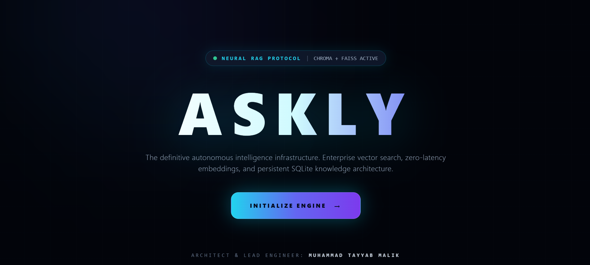

# ⚡ ASKLY Enterprise RAG & Neural Intelligence Infrastructure

<div align="center">

[](https://www.python.org/)
[](https://fastapi.tiangolo.com/)
[](https://react.dev/)
[](https://tailwindcss.com/)
[](https://www.sqlite.org/)

**The definitive autonomous intelligence infrastructure featuring enterprise vector search, zero-latency embeddings, semantic query rewriting, and persistent SQLite knowledge architecture.**

<div align="center">

# ⚡ ASKLY ENTERPRISE RAG
**The Definitive Autonomous Intelligence Infrastructure**

*Enterprise vector search, zero-latency embeddings, semantic query rewriting, and persistent SQLite knowledge architecture.*

</div>

---

## 🚀 1. Project Overview

**ASKLY** is a production-grade, full-stack Enterprise RAG (Retrieval-Augmented Generation) system designed to act as an advanced AI assistant—functioning similarly to ChatGPT or other elite LLM interfaces, capable of answering any query both from ingested PDF documents and general out-of-box knowledge. 

ASKLY features smart query rewriting, semantic chunking, and dual-mode intelligence that seamlessly blends localized vector search with broad LLM capabilities. It is managed through a modern, Silicon Valley-inspired dark/light interface complete with real-time telemetry and a persistent SQLite knowledge vault.

* **Context:** Developed as my Internship Capstone Project in AI Engineering at **Visionerds** (Summer 2026).
* **Supervised By:** Ms. Eman Mohsin
* **Architect & Lead Engineer:** Muhammad Tayyab Malik

---
<div align="center">



</div>

---

## ✨ 2. Key Features

1. **Hybrid AI Generation (PDF + General Chat):** Functions like ChatGPT, providing precise context from uploaded documents via RAG while seamlessly falling back to general LLM knowledge for out-of-context queries.
2. **Advanced RAG Pipeline:** Semantic chunking, high-speed vector retrieval (ChromaDB / FAISS), and intelligent query rewriting.
3. **Persistent SQLite Vault:** Instant note recording and session-based retrieval displayed directly in the dashboard UI.
4. **Command Center (`⌘K`):** Quick operational shortcuts for rapid navigation and preset queries.
5. **Live Telemetry HUD:** Real-time backend latency monitoring and active session tracking.
6. **Silicon Valley UI/UX:** Immersive Dark and Clean Light aesthetic built with Tailwind CSS and smooth micro-interactions.

---

## 🛠️ 3. Tech Stack

### **Backend**
* **Framework:** FastAPI (Python)
* **Vector Database & Search:** ChromaDB / FAISS
* **Database & Persistence:** SQLite (Async / Native)
* **LLM Integration:** Groq API (`llama-3.3-70b-versatile`) & Gemini API

### **Frontend**
* **Library:** React (Vite)
* **Styling:** Tailwind CSS
* **State & Interactivity:** React Hooks, Custom Spotlight Effects, Command Palette Modal

---

## 📂 4. Project Architecture & Structure

```text
ASKLY/
├── app/                  # FastAPI Backend Modules & Routers
│   ├── api/              # Endpoints (/chat, /notes, etc.)
│   ├── core/             # LLM Client & Configurations
│   └── main.py           # FastAPI Application Entrypoint
├── askly-frontend/       # React + Vite Frontend Application
│   ├── src/              # Components & App.jsx
│   └── package.json      # Frontend Dependencies
├── chroma_db/            # Vector Embeddings Storage
├── data/                 # Raw Document Vault
├── askly.db              # Persistent SQLite Database
├── requirements.txt      # Python Dependencies
└── .env                  # Environment Configuration

⚙️ 5. Installation and Setup
Prerequisites
Python 3.10+

Node.js & npm

Backend Setup
Clone the repository and navigate to the root directory.

Create and activate a virtual environment:

Bash
python -m venv venv
# On Windows:
venv\Scripts\activate
Install Python dependencies:

Bash
pip install -r requirements.txt
Configure your .env file in the root directory:

Code snippet
GROQ_API_KEY=your_groq_api_key_here
LLM_MODEL=llama-3.3-70b-versatile
Run the FastAPI backend server:

Bash
uvicorn app.main:app --reload --port 8000
Frontend Setup
Navigate to the frontend directory:

Bash
cd askly-frontend
Install node modules:

Bash
npm install
Run the development server:

Bash
npm run dev
Open your browser and go to http://localhost:5173.

🚀 6. Usage
Onboarding: Enter your professional operator credentials / full name on the gateway screen.

Interactive Chat: Type technical queries or general prompts into the chat console. The system will retrieve context from local vector embeddings or provide general AI generations.

Command Palette: Press Ctrl + K (or Cmd + K) to launch the neural command center for quick shortcuts.

Note Management: Command the AI to save notes (e.g., "Save a note titled 'AI PROJECT' with content...") to store records instantly into the persistent SQLite vault on the right sidebar.

📚 7. API Documentation
Once the backend server is running, interactive API documentation can be accessed directly via Swagger UI or ReDoc:

Swagger UI: http://localhost:8000/docs

ReDoc: http://localhost:8000/redoc

🧪 8. Testing
Backend Health & Endpoints: Test core endpoints via /docs.

Latency Check: Monitor response performance through the live telemetry HUD in the top navigation bar of the dashboard.

⚠️ 9. Limitations & Future Improvements
Limitations
Vector search accuracy depends on the quality and format of ingested documents inside the ./data directory.

Relies on external API rate limits (Groq/Gemini) during heavy parallel querying.

Future Improvements
Implement multi-modal document ingestion (direct PDF/Image file upload via UI).

Add multi-tenant user authentication with JWT security tokens.

Expand persistent storage support to PostgreSQL for enterprise horizontal scaling.

🛡️ Architect & Lead Engineer
Developed by: Muhammad Tayyab Malik

Supervised by: Ms. Eman Mohsin

Organization: Visionerds (AI Engineering Internship - Summer 2026)